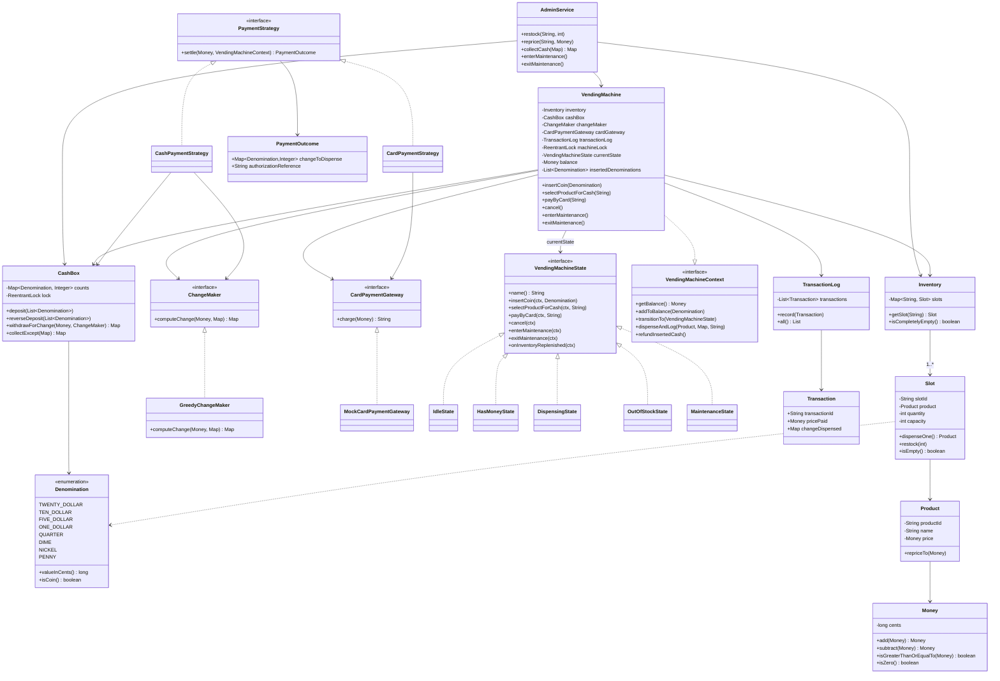

# Class Diagram

This matches the actual classes in `src/main/java/lld/vendingmachine`.

```mermaid
classDiagram
    class Money {
        -long cents
        +add(Money) Money
        +subtract(Money) Money
        +isGreaterThanOrEqualTo(Money) boolean
        +isZero() boolean
    }

    class Denomination {
        <<enumeration>>
        TWENTY_DOLLAR
        TEN_DOLLAR
        FIVE_DOLLAR
        ONE_DOLLAR
        QUARTER
        DIME
        NICKEL
        PENNY
        +valueInCents() long
        +isCoin() boolean
    }

    class Product {
        -String productId
        -String name
        -Money price
        +repriceTo(Money)
    }

    class Slot {
        -String slotId
        -Product product
        -int quantity
        -int capacity
        +dispenseOne() Product
        +restock(int)
        +isEmpty() boolean
    }

    class Inventory {
        -Map~String, Slot~ slots
        +getSlot(String) Slot
        +isCompletelyEmpty() boolean
    }

    class CashBox {
        -Map~Denomination, Integer~ counts
        -ReentrantLock lock
        +deposit(List~Denomination~)
        +reverseDeposit(List~Denomination~)
        +withdrawForChange(Money, ChangeMaker) Map
        +collectExcept(Map) Map
    }

    class ChangeMaker {
        <<interface>>
        +computeChange(Money, Map) Map
    }

    class GreedyChangeMaker {
        +computeChange(Money, Map) Map
    }

    class PaymentStrategy {
        <<interface>>
        +settle(Money, VendingMachineContext) PaymentOutcome
    }

    class CashPaymentStrategy
    class CardPaymentStrategy

    class CardPaymentGateway {
        <<interface>>
        +charge(Money) String
    }

    class MockCardPaymentGateway

    class PaymentOutcome {
        +Map~Denomination,Integer~ changeToDispense
        +String authorizationReference
    }

    class VendingMachineContext {
        <<interface>>
        +getBalance() Money
        +addToBalance(Denomination)
        +transitionTo(VendingMachineState)
        +dispenseAndLog(Product, Map, String)
        +refundInsertedCash()
    }

    class VendingMachineState {
        <<interface>>
        +name() String
        +insertCoin(ctx, Denomination)
        +selectProductForCash(ctx, String)
        +payByCard(ctx, String)
        +cancel(ctx)
        +enterMaintenance(ctx)
        +exitMaintenance(ctx)
        +onInventoryReplenished(ctx)
    }

    class IdleState
    class HasMoneyState
    class DispensingState
    class OutOfStockState
    class MaintenanceState

    class VendingMachine {
        -Inventory inventory
        -CashBox cashBox
        -ChangeMaker changeMaker
        -CardPaymentGateway cardGateway
        -TransactionLog transactionLog
        -ReentrantLock machineLock
        -VendingMachineState currentState
        -Money balance
        -List~Denomination~ insertedDenominations
        +insertCoin(Denomination)
        +selectProductForCash(String)
        +payByCard(String)
        +cancel()
        +enterMaintenance()
        +exitMaintenance()
    }

    class TransactionLog {
        -List~Transaction~ transactions
        +record(Transaction)
        +all() List
    }

    class Transaction {
        +String transactionId
        +Money pricePaid
        +Map changeDispensed
    }

    class AdminService {
        +restock(String, int)
        +reprice(String, Money)
        +collectCash(Map) Map
        +enterMaintenance()
        +exitMaintenance()
    }

    VendingMachine ..|> VendingMachineContext
    VendingMachine --> VendingMachineState : currentState
    VendingMachineState <|.. IdleState
    VendingMachineState <|.. HasMoneyState
    VendingMachineState <|.. DispensingState
    VendingMachineState <|.. OutOfStockState
    VendingMachineState <|.. MaintenanceState

    PaymentStrategy <|.. CashPaymentStrategy
    PaymentStrategy <|.. CardPaymentStrategy
    CardPaymentStrategy --> CardPaymentGateway
    CardPaymentGateway <|.. MockCardPaymentGateway
    CashPaymentStrategy --> ChangeMaker
    CashPaymentStrategy --> CashBox
    PaymentStrategy --> PaymentOutcome

    ChangeMaker <|.. GreedyChangeMaker

    VendingMachine --> Inventory
    VendingMachine --> CashBox
    VendingMachine --> TransactionLog
    VendingMachine --> ChangeMaker
    VendingMachine --> CardPaymentGateway
    TransactionLog --> Transaction

    Inventory --> Slot : 1..*
    Slot --> Product
    Product --> Money
    Slot ..> Denomination
    CashBox --> Denomination

    AdminService --> VendingMachine
    AdminService --> Inventory
    AdminService --> CashBox
```
