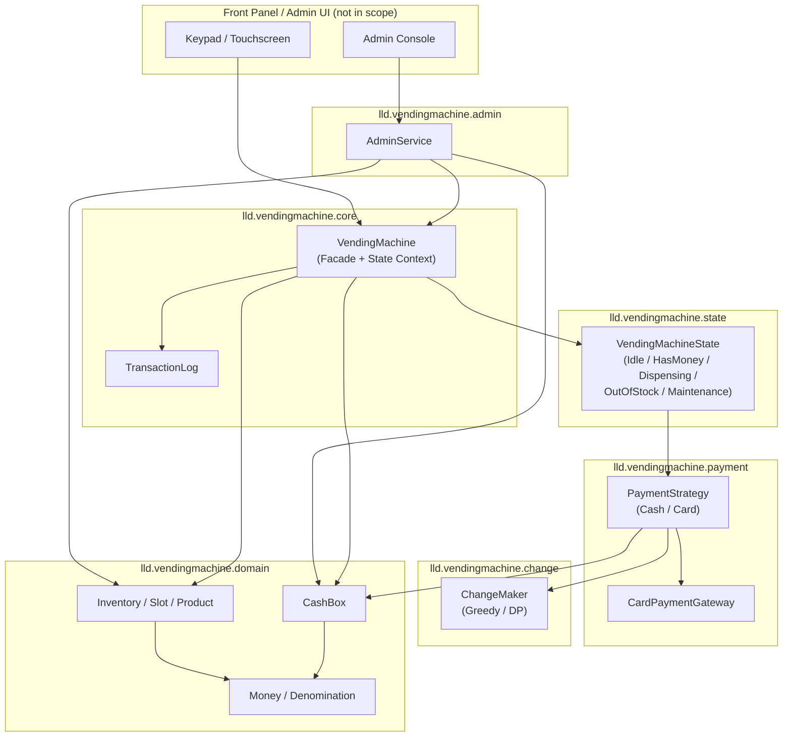

# Component Diagram

High-level package/component view. Arrows show "depends on".

```mermaid
flowchart TB
    subgraph UI["Front Panel / Admin UI (not in scope)"]
        Keypad["Keypad / Touchscreen"]
        AdminConsole["Admin Console"]
    end

    subgraph Core["lld.vendingmachine.core"]
        VM["VendingMachine\n(Facade + State Context)"]
        TXN["TransactionLog"]
    end

    subgraph State["lld.vendingmachine.state"]
        ST["VendingMachineState\n(Idle / HasMoney / Dispensing /\nOutOfStock / Maintenance)"]
    end

    subgraph Payment["lld.vendingmachine.payment"]
        PS["PaymentStrategy\n(Cash / Card)"]
        GW["CardPaymentGateway"]
    end

    subgraph Change["lld.vendingmachine.change"]
        CM["ChangeMaker\n(Greedy / DP)"]
    end

    subgraph Domain["lld.vendingmachine.domain"]
        INV["Inventory / Slot / Product"]
        CB["CashBox"]
        MNY["Money / Denomination"]
    end

    subgraph Admin["lld.vendingmachine.admin"]
        AS["AdminService"]
    end

    Keypad --> VM
    AdminConsole --> AS
    AS --> VM
    AS --> INV
    AS --> CB
    VM --> ST
    ST --> PS
    PS --> CB
    PS --> GW
    PS --> CM
    VM --> INV
    VM --> CB
    VM --> TXN
    INV --> MNY
    CB --> MNY
```
