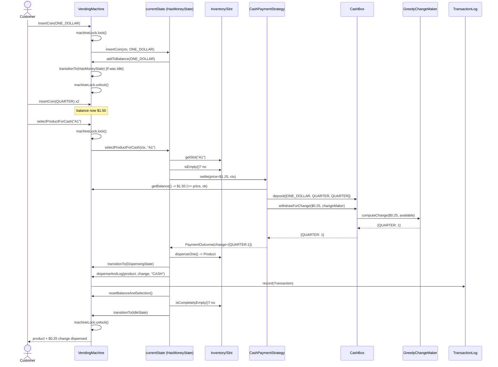

# Sequence Diagram — Cash Purchase (happy path + change)

```mermaid
sequenceDiagram
    actor Customer
    participant VM as VendingMachine
    participant S as currentState (HasMoneyState)
    participant Slot as Inventory/Slot
    participant PS as CashPaymentStrategy
    participant CB as CashBox
    participant CM as GreedyChangeMaker
    participant Log as TransactionLog

    Customer->>VM: insertCoin(ONE_DOLLAR)
    VM->>VM: machineLock.lock()
    VM->>S: insertCoin(ctx, ONE_DOLLAR)
    S->>VM: addToBalance(ONE_DOLLAR)
    VM->>VM: transitionTo(HasMoneyState) [if was Idle]
    VM->>VM: machineLock.unlock()

    Customer->>VM: insertCoin(QUARTER) x2
    Note over VM: balance now $1.50

    Customer->>VM: selectProductForCash("A1")
    VM->>VM: machineLock.lock()
    VM->>S: selectProductForCash(ctx, "A1")
    S->>Slot: getSlot("A1")
    S->>Slot: isEmpty()? no
    S->>PS: settle(price=$1.25, ctx)
    PS->>VM: getBalance() -> $1.50 (>= price, ok)
    PS->>CB: deposit([ONE_DOLLAR, QUARTER, QUARTER])
    PS->>CB: withdrawForChange($0.25, changeMaker)
    CB->>CM: computeChange($0.25, available)
    CM-->>CB: {QUARTER: 1}
    CB-->>PS: {QUARTER: 1}
    PS-->>S: PaymentOutcome(change={QUARTER:1})
    S->>Slot: dispenseOne() -> Product
    S->>VM: transitionTo(DispensingState)
    S->>VM: dispenseAndLog(product, change, "CASH")
    VM->>Log: record(Transaction)
    S->>VM: resetBalanceAndSelection()
    S->>Slot: isCompletelyEmpty()? no
    S->>VM: transitionTo(IdleState)
    VM->>VM: machineLock.unlock()
    VM-->>Customer: product + $0.25 change dispensed
```
