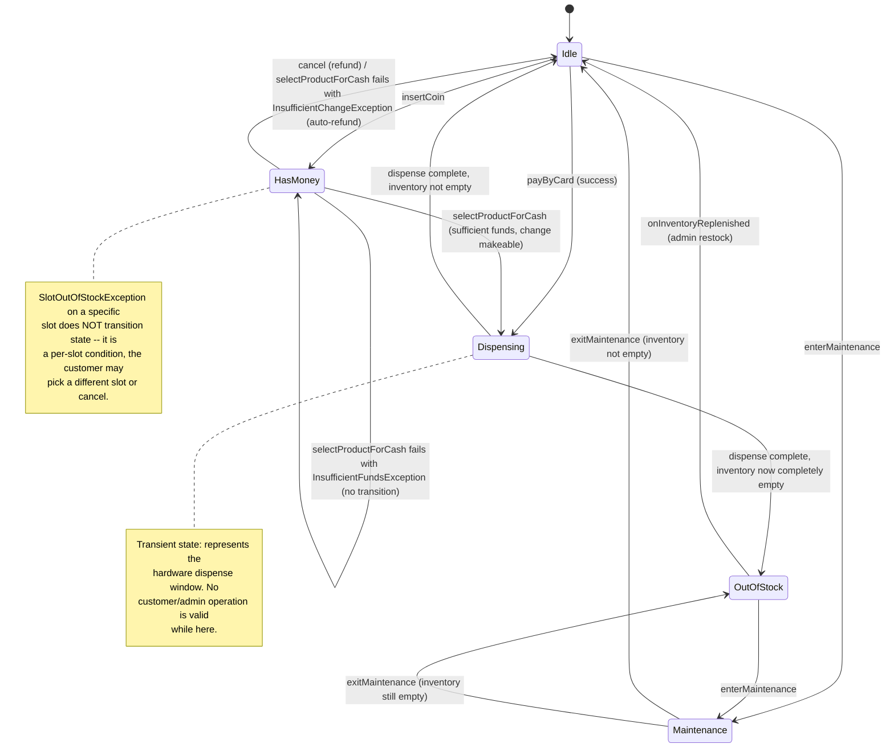

# State Diagram

```mermaid
stateDiagram-v2
    [*] --> Idle

    Idle --> HasMoney: insertCoin
    Idle --> Dispensing: payByCard (success)
    Idle --> Maintenance: enterMaintenance

    HasMoney --> HasMoney: insertCoin
    HasMoney --> Dispensing: selectProductForCash (sufficient funds, change makeable)
    HasMoney --> Idle: cancel (refund) / selectProductForCash fails with InsufficientChangeException (auto-refund)
    HasMoney --> HasMoney: selectProductForCash fails with InsufficientFundsException (no transition)

    Dispensing --> Idle: dispense complete, inventory not empty
    Dispensing --> OutOfStock: dispense complete, inventory now completely empty

    OutOfStock --> Idle: onInventoryReplenished (admin restock)
    OutOfStock --> Maintenance: enterMaintenance

    Maintenance --> Idle: exitMaintenance (inventory not empty)
    Maintenance --> OutOfStock: exitMaintenance (inventory still empty)

    note right of HasMoney
        SlotOutOfStockException on a specific
        slot does NOT transition state -- it is
        a per-slot condition, the customer may
        pick a different slot or cancel.
    end note

    note right of Dispensing
        Transient state: represents the
        hardware dispense window. No
        customer/admin operation is valid
        while here.
    end note
```
