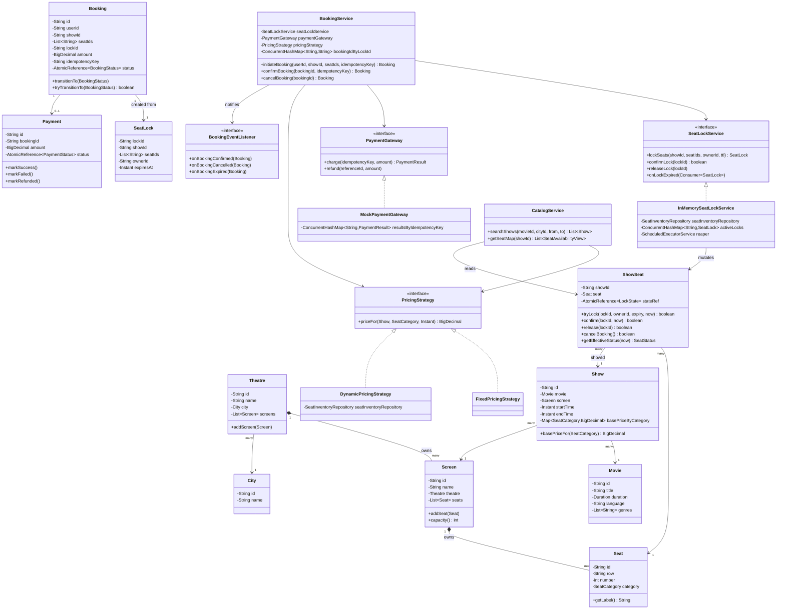

# Class Diagram

```mermaid
classDiagram
    class City {
        -String id
        -String name
    }

    class Theatre {
        -String id
        -String name
        -City city
        -List~Screen~ screens
        +addScreen(Screen)
    }

    class Screen {
        -String id
        -String name
        -Theatre theatre
        -List~Seat~ seats
        +addSeat(Seat)
        +capacity() int
    }

    class Seat {
        -String id
        -String row
        -int number
        -SeatCategory category
        +getLabel() String
    }

    class Movie {
        -String id
        -String title
        -Duration duration
        -String language
        -List~String~ genres
    }

    class Show {
        -String id
        -Movie movie
        -Screen screen
        -Instant startTime
        -Instant endTime
        -Map~SeatCategory,BigDecimal~ basePriceByCategory
        +basePriceFor(SeatCategory) BigDecimal
    }

    class ShowSeat {
        -String showId
        -Seat seat
        -AtomicReference~LockState~ stateRef
        +tryLock(lockId, ownerId, expiry, now) boolean
        +confirm(lockId, now) boolean
        +release(lockId) boolean
        +cancelBooking() boolean
        +getEffectiveStatus(now) SeatStatus
    }

    class SeatLock {
        -String lockId
        -String showId
        -List~String~ seatIds
        -String ownerId
        -Instant expiresAt
    }

    class Booking {
        -String id
        -String userId
        -String showId
        -List~String~ seatIds
        -String lockId
        -BigDecimal amount
        -String idempotencyKey
        -AtomicReference~BookingStatus~ status
        +transitionTo(BookingStatus)
        +tryTransitionTo(BookingStatus) boolean
    }

    class Payment {
        -String id
        -String bookingId
        -BigDecimal amount
        -AtomicReference~PaymentStatus~ status
        +markSuccess()
        +markFailed()
        +markRefunded()
    }

    class SeatLockService {
        <<interface>>
        +lockSeats(showId, seatIds, ownerId, ttl) SeatLock
        +confirmLock(lockId) boolean
        +releaseLock(lockId)
        +onLockExpired(Consumer~SeatLock~)
    }

    class InMemorySeatLockService {
        -SeatInventoryRepository seatInventoryRepository
        -ConcurrentHashMap~String,SeatLock~ activeLocks
        -ScheduledExecutorService reaper
    }

    class PaymentGateway {
        <<interface>>
        +charge(idempotencyKey, amount) PaymentResult
        +refund(referenceId, amount)
    }

    class MockPaymentGateway {
        -ConcurrentHashMap~String,PaymentResult~ resultsByIdempotencyKey
    }

    class PricingStrategy {
        <<interface>>
        +priceFor(Show, SeatCategory, Instant) BigDecimal
    }

    class FixedPricingStrategy
    class DynamicPricingStrategy {
        -SeatInventoryRepository seatInventoryRepository
    }

    class CatalogService {
        +searchShows(movieId, cityId, from, to) List~Show~
        +getSeatMap(showId) List~SeatAvailabilityView~
    }

    class BookingService {
        -SeatLockService seatLockService
        -PaymentGateway paymentGateway
        -PricingStrategy pricingStrategy
        -ConcurrentHashMap~String,String~ bookingIdByLockId
        +initiateBooking(userId, showId, seatIds, idempotencyKey) Booking
        +confirmBooking(bookingId, idempotencyKey) Booking
        +cancelBooking(bookingId) Booking
    }

    class BookingEventListener {
        <<interface>>
        +onBookingConfirmed(Booking)
        +onBookingCancelled(Booking)
        +onBookingExpired(Booking)
    }

    Theatre "1" *-- "many" Screen : owns
    Screen "1" *-- "many" Seat : owns
    Theatre "many" --> "1" City
    Show "many" --> "1" Movie
    Show "many" --> "1" Screen
    ShowSeat "many" --> "1" Seat
    ShowSeat "many" --> "1" Show : showId
    Booking "1" --> "1" SeatLock : created from
    Booking "1" --> "0..1" Payment
    SeatLockService <|.. InMemorySeatLockService
    PaymentGateway <|.. MockPaymentGateway
    PricingStrategy <|.. FixedPricingStrategy
    PricingStrategy <|.. DynamicPricingStrategy
    InMemorySeatLockService --> ShowSeat : mutates
    BookingService --> SeatLockService
    BookingService --> PaymentGateway
    BookingService --> PricingStrategy
    BookingService --> BookingEventListener : notifies
    CatalogService --> PricingStrategy
    CatalogService --> ShowSeat : reads
```

This diagram matches `src/main/java/lld/bookmyshow` 1:1 — every class/interface shown exists with the listed methods (abbreviated to the ones discussed in the README).
