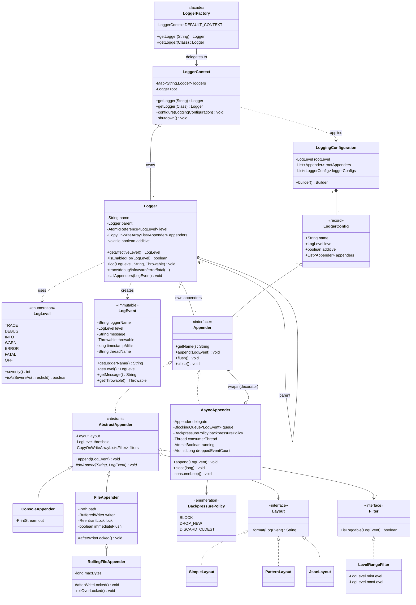

# Class Diagram

Matches the actual classes under `src/main/java/lld/logging`.

```mermaid
classDiagram
    class LogLevel {
        <<enumeration>>
        TRACE
        DEBUG
        INFO
        WARN
        ERROR
        FATAL
        OFF
        +severity() int
        +isAsSevereAs(threshold) boolean
    }

    class LogEvent {
        <<immutable>>
        -String loggerName
        -LogLevel level
        -String message
        -Throwable throwable
        -long timestampMillis
        -String threadName
        +getLoggerName() String
        +getLevel() LogLevel
        +getMessage() String
        +getThrowable() Throwable
    }

    class Logger {
        -String name
        -Logger parent
        -AtomicReference~LogLevel~ level
        -CopyOnWriteArrayList~Appender~ appenders
        -volatile boolean additive
        +getEffectiveLevel() LogLevel
        +isEnabledFor(LogLevel) boolean
        +log(LogLevel, String, Throwable) void
        +trace/debug/info/warn/error/fatal(...)
        -callAppenders(LogEvent) void
    }

    class LoggerContext {
        -Map~String,Logger~ loggers
        -Logger root
        +getLogger(String) Logger
        +getLogger(Class) Logger
        +configure(LoggingConfiguration) void
        +shutdown() void
    }

    class LoggerFactory {
        <<facade>>
        -LoggerContext DEFAULT_CONTEXT
        +getLogger(String)$ Logger
        +getLogger(Class)$ Logger
    }

    class LoggingConfiguration {
        -LogLevel rootLevel
        -List~Appender~ rootAppenders
        -List~LoggerConfig~ loggerConfigs
        +builder()$ Builder
    }

    class LoggerConfig {
        <<record>>
        +String name
        +LogLevel level
        +boolean additive
        +List~Appender~ appenders
    }

    class Appender {
        <<interface>>
        +getName() String
        +append(LogEvent) void
        +flush() void
        +close() void
    }

    class AbstractAppender {
        <<abstract>>
        -Layout layout
        -LogLevel threshold
        -CopyOnWriteArrayList~Filter~ filters
        +append(LogEvent) void
        #doAppend(String, LogEvent)* void
    }

    class ConsoleAppender {
        -PrintStream out
    }

    class FileAppender {
        -Path path
        -BufferedWriter writer
        -ReentrantLock lock
        -boolean immediateFlush
        #afterWriteLocked() void
    }

    class RollingFileAppender {
        -long maxBytes
        #afterWriteLocked() void
        -rollOverLocked() void
    }

    class AsyncAppender {
        -Appender delegate
        -BlockingQueue~LogEvent~ queue
        -BackpressurePolicy backpressurePolicy
        -Thread consumerThread
        -AtomicBoolean running
        -AtomicLong droppedEventCount
        +append(LogEvent) void
        +close(long) void
        -consumeLoop() void
    }

    class BackpressurePolicy {
        <<enumeration>>
        BLOCK
        DROP_NEW
        DISCARD_OLDEST
    }

    class Layout {
        <<interface>>
        +format(LogEvent) String
    }

    class SimpleLayout
    class PatternLayout
    class JsonLayout

    class Filter {
        <<interface>>
        +isLoggable(LogEvent) boolean
    }

    class LevelRangeFilter {
        -LogLevel minLevel
        -LogLevel maxLevel
    }

    LoggerFactory --> LoggerContext : delegates to
    LoggerContext "1" o-- "*" Logger : owns
    Logger "1" --> "0..1" Logger : parent
    Logger "1" o-- "*" Appender : own appenders
    Logger ..> LogEvent : creates
    Logger ..> LogLevel : uses

    LoggerContext ..> LoggingConfiguration : applies
    LoggingConfiguration "1" *-- "*" LoggerConfig
    LoggerConfig "1" o-- "*" Appender

    Appender <|.. AbstractAppender
    AbstractAppender <|-- ConsoleAppender
    AbstractAppender <|-- FileAppender
    FileAppender <|-- RollingFileAppender
    Appender <|.. AsyncAppender
    AsyncAppender o--> Appender : wraps (decorator)
    AsyncAppender --> BackpressurePolicy

    AbstractAppender o--> Layout
    AbstractAppender o--> "*" Filter
    Layout <|.. SimpleLayout
    Layout <|.. PatternLayout
    Layout <|.. JsonLayout
    Filter <|.. LevelRangeFilter
```
