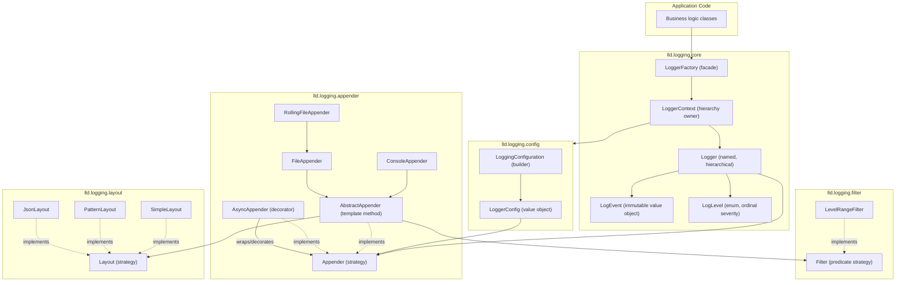

# Component Diagram

Shows the major packages/modules and the direction of dependency. Arrows
point from a dependent to its dependency.

```mermaid
flowchart TB
    subgraph App["Application Code"]
        AppCode["Business logic classes"]
    end

    subgraph Core["lld.logging.core"]
        LoggerFactory["LoggerFactory (facade)"]
        LoggerContext["LoggerContext (hierarchy owner)"]
        Logger["Logger (named, hierarchical)"]
        LogEvent["LogEvent (immutable value object)"]
        LogLevel["LogLevel (enum, ordinal severity)"]
    end

    subgraph Config["lld.logging.config"]
        LoggingConfiguration["LoggingConfiguration (builder)"]
        LoggerConfig["LoggerConfig (value object)"]
    end

    subgraph Filter["lld.logging.filter"]
        FilterIface["Filter (predicate strategy)"]
        LevelRangeFilter["LevelRangeFilter"]
    end

    subgraph Appender["lld.logging.appender"]
        AppenderIface["Appender (strategy)"]
        AbstractAppender["AbstractAppender (template method)"]
        ConsoleAppender["ConsoleAppender"]
        FileAppender["FileAppender"]
        RollingFileAppender["RollingFileAppender"]
        AsyncAppender["AsyncAppender (decorator)"]
    end

    subgraph Layout["lld.logging.layout"]
        LayoutIface["Layout (strategy)"]
        SimpleLayout["SimpleLayout"]
        PatternLayout["PatternLayout"]
        JsonLayout["JsonLayout"]
    end

    AppCode --> LoggerFactory
    LoggerFactory --> LoggerContext
    LoggerContext --> Logger
    LoggerContext --> Config
    Logger --> LogEvent
    Logger --> LogLevel
    Logger --> AppenderIface
    LoggingConfiguration --> LoggerConfig
    LoggerConfig --> AppenderIface

    AbstractAppender -.implements.-> AppenderIface
    ConsoleAppender --> AbstractAppender
    FileAppender --> AbstractAppender
    RollingFileAppender --> FileAppender
    AsyncAppender -.implements.-> AppenderIface
    AsyncAppender -->|wraps/decorates| AppenderIface

    AbstractAppender --> LayoutIface
    AbstractAppender --> FilterIface
    SimpleLayout -.implements.-> LayoutIface
    PatternLayout -.implements.-> LayoutIface
    JsonLayout -.implements.-> LayoutIface
    LevelRangeFilter -.implements.-> FilterIface
```
