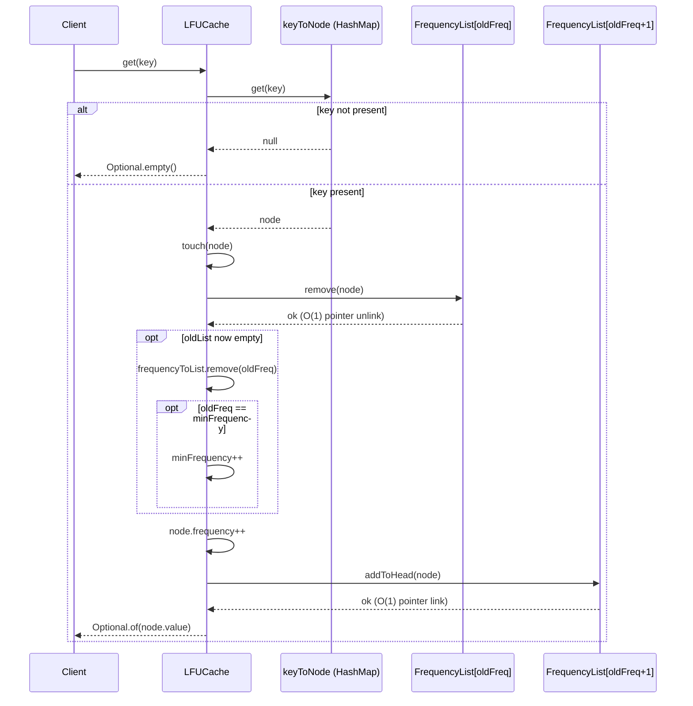

# Sequence Diagram: `get(key)`

Two cases: cache hit (frequency bump, possible `minFrequency` advance) and
cache miss (no mutation at all).

```mermaid
sequenceDiagram
    participant Client
    participant LFUCache
    participant keyToNode as keyToNode (HashMap)
    participant oldList as FrequencyList[oldFreq]
    participant newList as FrequencyList[oldFreq+1]

    Client->>LFUCache: get(key)
    LFUCache->>keyToNode: get(key)
    alt key not present
        keyToNode-->>LFUCache: null
        LFUCache-->>Client: Optional.empty()
    else key present
        keyToNode-->>LFUCache: node
        LFUCache->>LFUCache: touch(node)
        LFUCache->>oldList: remove(node)
        oldList-->>LFUCache: ok (O(1) pointer unlink)
        opt oldList now empty
            LFUCache->>LFUCache: frequencyToList.remove(oldFreq)
            opt oldFreq == minFrequency
                LFUCache->>LFUCache: minFrequency++
            end
        end
        LFUCache->>LFUCache: node.frequency++
        LFUCache->>newList: addToHead(node)
        newList-->>LFUCache: ok (O(1) pointer link)
        LFUCache-->>Client: Optional.of(node.value)
    end
```
