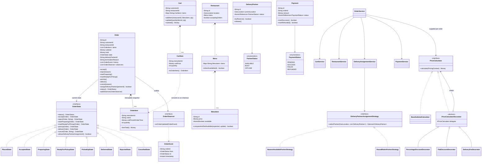

# Class Diagram

```mermaid
classDiagram
    class Order {
        -String id
        -String customerId
        -String restaurantId
        -List~OrderItem~ items
        -Money subtotal
        -Money total
        -OrderState state
        -String deliveryPartnerId
        -String terminationReason
        -List~OrderEvent~ history
        -List~OrderObserver~ observers
        +accept()
        +reject(reason)
        +startPreparing()
        +markReadyForPickup()
        +pickUp()
        +deliver()
        +cancel(reason)
        +assignDeliveryPartner(partnerId) boolean
        +status() OrderStatus
        +addObserver(OrderObserver)
    }

    class OrderState {
        <<interface>>
        +status() OrderStatus
        +accept(Order) OrderState
        +reject(Order, String) OrderState
        +startPreparing(Order) OrderState
        +markReadyForPickup(Order) OrderState
        +pickUp(Order) OrderState
        +deliver(Order) OrderState
        +cancel(Order, String) OrderState
        +allowsDeliveryPartnerAssignment() boolean
    }
    class PlacedState
    class AcceptedState
    class PreparingState
    class ReadyForPickupState
    class PickedUpState
    class DeliveredState
    class RejectedState
    class CancelledState

    OrderState <|.. PlacedState
    OrderState <|.. AcceptedState
    OrderState <|.. PreparingState
    OrderState <|.. ReadyForPickupState
    OrderState <|.. PickedUpState
    OrderState <|.. DeliveredState
    OrderState <|.. RejectedState
    OrderState <|.. CancelledState
    Order --> OrderState : current state

    class OrderItem {
        -String menuItemId
        -String name
        -Money unitPriceAtOrderTime
        -int quantity
        +lineTotal() Money
    }
    Order "1" *-- "many" OrderItem : immutable snapshot

    class Cart {
        -String customerId
        -String restaurantId
        -Map~String,CartItem~ items
        +addItem(restaurantId, MenuItem, qty)
        +updateQuantity(itemId, qty)
        +subtotal() Money
    }
    class CartItem {
        -String menuItemId
        -Money unitPrice
        -int quantity
        +toOrderItem() OrderItem
    }
    Cart "1" *-- "many" CartItem
    CartItem ..> OrderItem : converts to on checkout

    class Restaurant {
        -String id
        -GeoLocation location
        -Menu menu
        -boolean acceptingOrders
    }
    class Menu {
        -Map~String,MenuItem~ items
        +isItemAvailable(id) boolean
    }
    class MenuItem {
        -String id
        -Money price
        -AtomicBoolean available
        +compareAndSetAvailable(expected, update) boolean
    }
    Restaurant "1" *-- "1" Menu
    Menu "1" *-- "many" MenuItem

    class DeliveryPartner {
        -String id
        -GeoLocation currentLocation
        -AtomicReference~PartnerStatus~ status
        +tryReserve() boolean
        +release()
    }
    class PartnerStatus {
        <<enumeration>>
        AVAILABLE
        BUSY
        OFFLINE
    }
    DeliveryPartner --> PartnerStatus

    class Payment {
        -String id
        -String orderId
        -Money amount
        -AtomicReference~PaymentStatus~ status
        +markSuccess() boolean
        +markRefunded() boolean
    }
    class PaymentStatus {
        <<enumeration>>
        PENDING
        SUCCESS
        FAILED
        REFUNDED
    }
    Payment --> PaymentStatus

    class OrderObserver {
        <<interface>>
        +onOrderUpdated(OrderEvent)
    }
    class OrderEvent {
        +String orderId
        +OrderStatus from
        +OrderStatus to
        +Instant timestamp
    }
    Order --> OrderObserver : notifies
    OrderObserver ..> OrderEvent

    class DeliveryPartnerAssignmentStrategy {
        <<interface>>
        +selectPartner(GeoLocation, List~DeliveryPartner~) Optional~DeliveryPartner~
    }
    class NearestAvailablePartnerStrategy
    class RoundRobinPartnerStrategy
    DeliveryPartnerAssignmentStrategy <|.. NearestAvailablePartnerStrategy
    DeliveryPartnerAssignmentStrategy <|.. RoundRobinPartnerStrategy

    class PriceCalculator {
        <<interface>>
        +calculate(PricingContext) Money
    }
    class BaseSubtotalCalculator
    class PriceCalculatorDecorator {
        <<abstract>>
        #PriceCalculator delegate
    }
    class PercentageDiscountDecorator
    class FlatDiscountDecorator
    class DeliveryFeeDecorator
    PriceCalculator <|.. BaseSubtotalCalculator
    PriceCalculator <|.. PriceCalculatorDecorator
    PriceCalculatorDecorator <|-- PercentageDiscountDecorator
    PriceCalculatorDecorator <|-- FlatDiscountDecorator
    PriceCalculatorDecorator <|-- DeliveryFeeDecorator
    PriceCalculatorDecorator o--> PriceCalculator : wraps

    class RestaurantService
    class CartService
    class OrderService
    class DeliveryAssignmentService
    class PaymentService
    OrderService --> CartService
    OrderService --> RestaurantService
    OrderService --> DeliveryAssignmentService
    OrderService --> PaymentService
    OrderService --> PriceCalculator : supplied per order
    DeliveryAssignmentService --> DeliveryPartnerAssignmentStrategy
```
