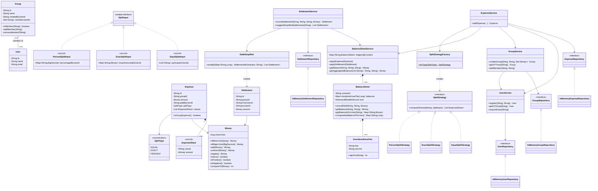

# Class Diagram

This diagram matches the actual classes under `src/main/java/lld/splitwise`.

```mermaid
classDiagram
    class Money {
        -long minorUnits
        +ofMinorUnits(long) Money
        +ofMajorUnits(BigDecimal) Money
        +add(Money) Money
        +subtract(Money) Money
        +negate() Money
        +isZero() boolean
        +isPositive() boolean
        +isNegative() boolean
        +compareTo(Money) int
    }

    class User {
        -String id
        -String name
        -String email
    }

    class Group {
        -String id
        -String name
        -String createdByUserId
        -Set~String~ memberUserIds
        +isMember(String) boolean
        +addMember(String)
        +removeMember(String)
    }

    class SplitType {
        <<enumeration>>
        EQUAL
        EXACT
        PERCENT
    }

    class ExpenseShare {
        <<record>>
        +String userId
        +Money amount
    }

    class Expense {
        -String id
        -String groupId
        -Money amount
        -String paidByUserId
        -SplitType splitType
        -List~ExpenseShare~ shares
        +isGroupExpense() boolean
    }

    class Settlement {
        -String id
        -String groupId
        -String fromUserId
        -String toUserId
        -Money amount
    }

    class SplitInput {
        <<sealed interface>>
    }
    class EqualSplitInput {
        <<record>>
        +List~String~ participantUserIds
    }
    class ExactSplitInput {
        <<record>>
        +Map~String,Money~ exactAmountsByUserId
    }
    class PercentSplitInput {
        <<record>>
        +Map~String,BigDecimal~ percentageByUserId
    }
    SplitInput <|.. EqualSplitInput
    SplitInput <|.. ExactSplitInput
    SplitInput <|.. PercentSplitInput

    class SplitStrategy {
        <<interface>>
        +computeShares(Money, SplitInput) List~ExpenseShare~
    }
    class EqualSplitStrategy
    class ExactSplitStrategy
    class PercentSplitStrategy
    SplitStrategy <|.. EqualSplitStrategy
    SplitStrategy <|.. ExactSplitStrategy
    SplitStrategy <|.. PercentSplitStrategy

    class SplitStrategyFactory {
        +forType(SplitType)$ SplitStrategy
    }
    SplitStrategyFactory ..> SplitStrategy : creates

    class UnorderedUserPair {
        -String first
        -String second
        +signFor(String) int
    }

    class BalanceSheet {
        -String contextId
        -Map~UnorderedUserPair,Long~ balances
        -ReentrantReadWriteLock lock
        +recordDebt(String, String, Money)
        +getBalance(String, String) Money
        +getBalancesForUser(String) Map~String,Money~
        +computeNetBalancePerUser() Map~String,Long~
    }
    BalanceSheet "1" *-- "many" UnorderedUserPair

    class BalanceSheetService {
        -Map~String,BalanceSheet~ ledgersByContext
        +applyExpense(Expense)
        +applySettlement(Settlement)
        +getBalance(String, String, String) Money
        +getAggregatedBalance(List~String~, String, String) Money
    }
    BalanceSheetService "1" *-- "many" BalanceSheet

    class DebtSimplifier {
        +simplify(Map~String,Long~, SettlementIdGenerator, String) List~Settlement~
    }
    DebtSimplifier ..> Settlement : creates

    class UserRepository { <<interface>> }
    class GroupRepository { <<interface>> }
    class ExpenseRepository { <<interface>> }
    class SettlementRepository { <<interface>> }
    class InMemoryUserRepository
    class InMemoryGroupRepository
    class InMemoryExpenseRepository
    class InMemorySettlementRepository
    UserRepository <|.. InMemoryUserRepository
    GroupRepository <|.. InMemoryGroupRepository
    ExpenseRepository <|.. InMemoryExpenseRepository
    SettlementRepository <|.. InMemorySettlementRepository

    class UserService {
        +register(String, String) User
        +getOrThrow(String) User
        +requireExists(String)
    }
    UserService --> UserRepository

    class GroupService {
        +createGroup(String, String, Set~String~) Group
        +getOrThrow(String) Group
        +addMember(String, String)
    }
    GroupService --> GroupRepository
    GroupService --> UserService

    class ExpenseService {
        +addExpense(...) Expense
    }
    ExpenseService --> ExpenseRepository
    ExpenseService --> UserService
    ExpenseService --> GroupService
    ExpenseService --> BalanceSheetService
    ExpenseService --> SplitStrategyFactory

    class SettlementService {
        +recordSettlement(String, String, String, Money) Settlement
        +suggestSimplifiedSettlements(String) List~Settlement~
    }
    SettlementService --> BalanceSheetService
    SettlementService --> SettlementRepository
    SettlementService --> DebtSimplifier

    Expense "1" *-- "many" ExpenseShare
    Expense --> Money
    Expense --> SplitType
    Settlement --> Money
    Group "many" o-- "many" User : member of
```
