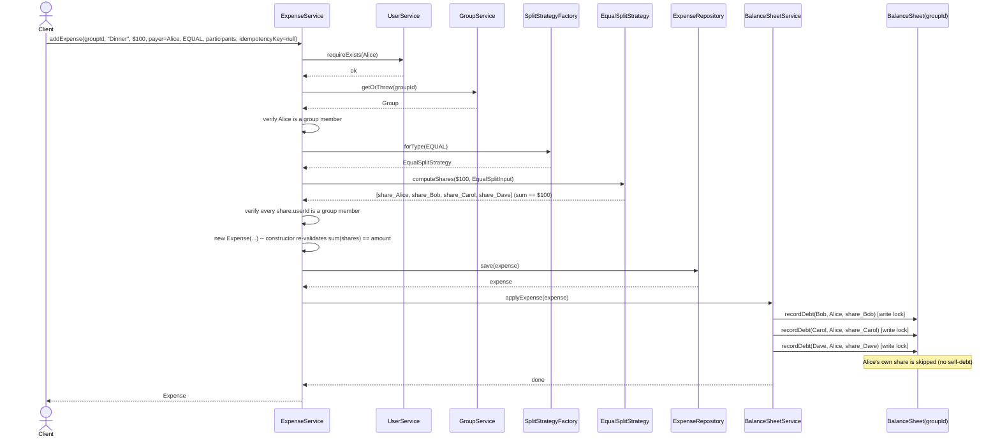
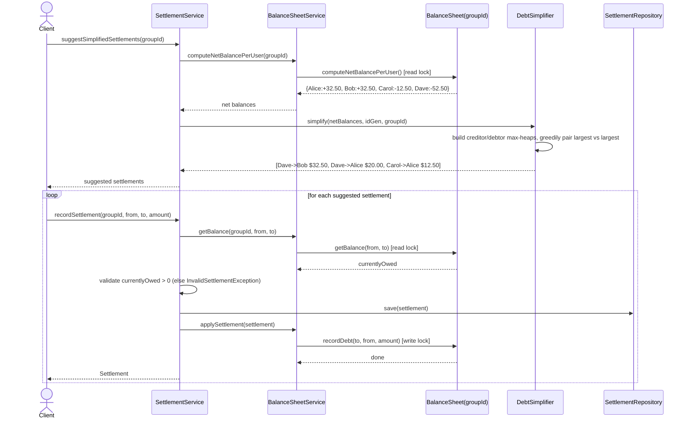
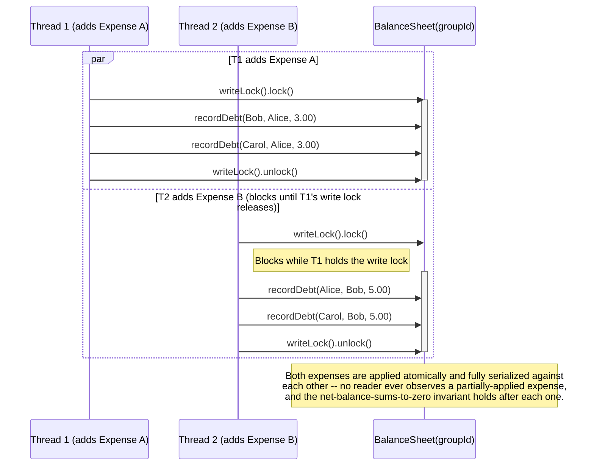

# Sequence Diagrams

## 1. Add Expense (EQUAL split, group expense)

```mermaid
sequenceDiagram
    actor Client
    participant ES as ExpenseService
    participant US as UserService
    participant GS as GroupService
    participant SSF as SplitStrategyFactory
    participant Strat as EqualSplitStrategy
    participant ER as ExpenseRepository
    participant BSS as BalanceSheetService
    participant BS as BalanceSheet(groupId)

    Client->>ES: addExpense(groupId, "Dinner", $100, payer=Alice, EQUAL, participants, idempotencyKey=null)
    ES->>US: requireExists(Alice)
    US-->>ES: ok
    ES->>GS: getOrThrow(groupId)
    GS-->>ES: Group
    ES->>ES: verify Alice is a group member
    ES->>SSF: forType(EQUAL)
    SSF-->>ES: EqualSplitStrategy
    ES->>Strat: computeShares($100, EqualSplitInput)
    Strat-->>ES: [share_Alice, share_Bob, share_Carol, share_Dave] (sum == $100)
    ES->>ES: verify every share.userId is a group member
    ES->>ES: new Expense(...) -- constructor re-validates sum(shares) == amount
    ES->>ER: save(expense)
    ER-->>ES: expense
    ES->>BSS: applyExpense(expense)
    BSS->>BS: recordDebt(Bob, Alice, share_Bob) [write lock]
    BSS->>BS: recordDebt(Carol, Alice, share_Carol) [write lock]
    BSS->>BS: recordDebt(Dave, Alice, share_Dave) [write lock]
    Note over BS: Alice's own share is skipped (no self-debt)
    BSS-->>ES: done
    ES-->>Client: Expense
```

## 2. Debt Simplification + Settle Up

```mermaid
sequenceDiagram
    actor Client
    participant SS as SettlementService
    participant BSS as BalanceSheetService
    participant BS as BalanceSheet(groupId)
    participant DSimp as DebtSimplifier
    participant SR as SettlementRepository

    Client->>SS: suggestSimplifiedSettlements(groupId)
    SS->>BSS: computeNetBalancePerUser(groupId)
    BSS->>BS: computeNetBalancePerUser() [read lock]
    BS-->>BSS: {Alice:+32.50, Bob:+32.50, Carol:-12.50, Dave:-52.50}
    BSS-->>SS: net balances
    SS->>DSimp: simplify(netBalances, idGen, groupId)
    DSimp->>DSimp: build creditor/debtor max-heaps, greedily pair largest vs largest
    DSimp-->>SS: [Dave->Bob $32.50, Dave->Alice $20.00, Carol->Alice $12.50]
    SS-->>Client: suggested settlements

    loop for each suggested settlement
        Client->>SS: recordSettlement(groupId, from, to, amount)
        SS->>BSS: getBalance(groupId, from, to)
        BSS->>BS: getBalance(from, to) [read lock]
        BS-->>BSS: currentlyOwed
        SS->>SS: validate currentlyOwed > 0 (else InvalidSettlementException)
        SS->>SR: save(settlement)
        SS->>BSS: applySettlement(settlement)
        BSS->>BS: recordDebt(to, from, amount) [write lock]
        BS-->>BSS: done
        SS-->>Client: Settlement
    end
```

## 3. Concurrent Expense Additions on the Same Group

```mermaid
sequenceDiagram
    participant T1 as Thread 1 (adds Expense A)
    participant T2 as Thread 2 (adds Expense B)
    participant BS as BalanceSheet(groupId)

    par T1 adds Expense A
        T1->>BS: writeLock().lock()
        activate BS
        T1->>BS: recordDebt(Bob, Alice, 3.00)
        T1->>BS: recordDebt(Carol, Alice, 3.00)
        T1->>BS: writeLock().unlock()
        deactivate BS
    and T2 adds Expense B (blocks until T1's write lock releases)
        T2->>BS: writeLock().lock()
        Note right of T2: Blocks while T1 holds the write lock
        activate BS
        T2->>BS: recordDebt(Alice, Bob, 5.00)
        T2->>BS: recordDebt(Carol, Bob, 5.00)
        T2->>BS: writeLock().unlock()
        deactivate BS
    end

    Note over BS: Both expenses are applied atomically and fully serialized against<br/>each other -- no reader ever observes a partially-applied expense,<br/>and the net-balance-sums-to-zero invariant holds after each one.
```
