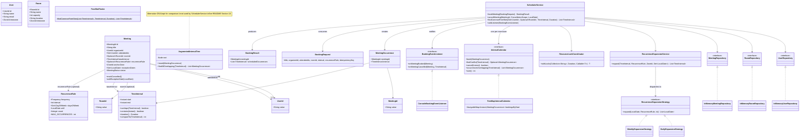

# Class Diagram

This mirrors the actual classes under `src/main/java/lld/meetingscheduler`.

```mermaid
classDiagram
    class UserId { +String value }
    class RoomId { +String value }
    class MeetingId { +String value }

    class TimeInterval {
        +Instant start
        +Instant end
        +overlaps(TimeInterval) boolean
        +contains(Instant) boolean
        +duration() Duration
        +compareTo(TimeInterval) int
    }

    class User {
        +UserId id
        +String name
        +String email
        +ZoneId timezone
    }

    class Room {
        +RoomId id
        +String name
        +int capacity
        +String location
        +ZoneId timezone
    }

    class RecurrenceRule {
        +Frequency frequency
        +int interval
        +Set~DayOfWeek~ daysOfWeek
        +LocalDate until
        +Integer count
        +MAX_OCCURRENCES : int
    }

    class Meeting {
        +MeetingId id
        +String title
        +UserId organizerId
        +Set~UserId~ attendeeIds
        +Optional~RoomId~ roomId
        +TimeInterval baseInterval
        +Optional~RecurrenceRule~ recurrenceRule
        +ZoneId anchorZone
        +Set~LocalDate~ exceptionDates
        +MeetingStatus status
        +markCancelled()
        +addExceptionDate(LocalDate)
    }

    class MeetingOccurrence {
        +MeetingId meetingId
        +TimeInterval interval
    }

    class BookingRequest {
        +title, organizerId, attendeeIds, roomId, interval, recurrenceRule, idempotencyKey
    }
    class BookingResult {
        +MeetingId meetingId
        +List~TimeInterval~ scheduledOccurrences
    }

    class IntervalCalendar {
        <<interface>>
        +book(MeetingOccurrence)
        +findConflict(TimeInterval) Optional~MeetingOccurrence~
        +cancel(Instant) boolean
        +occurrencesOverlapping(TimeInterval) List~MeetingOccurrence~
        +size() int
    }
    class TreeMapIntervalCalendar {
        -NavigableMap~Instant,MeetingOccurrence~ bookingsByStart
    }
    class AugmentedIntervalTree {
        -Node root
        +insert(MeetingOccurrence)
        +findAllOverlapping(TimeInterval) List~MeetingOccurrence~
    }

    class RecurrenceExpansionStrategy {
        <<interface>>
        +expand(LocalDate, RecurrenceRule, int) List~LocalDate~
    }
    class DailyExpansionStrategy
    class WeeklyExpansionStrategy

    class RecurrenceExpansionService {
        +expand(TimeInterval, RecurrenceRule, ZoneId, Set~LocalDate~) List~TimeInterval~
    }
    class FreeSlotFinder {
        +findCommonFreeSlots(List~TimeInterval~, TimeInterval, Duration)$ List~TimeInterval~
    }
    class ResourceLockCoordinator {
        +withLocks(Collection~String~, Duration, Callable~T~) T
    }

    class BookingEventListener {
        <<interface>>
        +onMeetingBooked(Meeting)
        +onMeetingCancelled(Meeting, TimeInterval)
    }
    class ConsoleBookingEventListener

    class UserRepository { <<interface>> }
    class RoomRepository { <<interface>> }
    class MeetingRepository { <<interface>> }
    class InMemoryUserRepository
    class InMemoryRoomRepository
    class InMemoryMeetingRepository

    class SchedulerService {
        +bookMeeting(BookingRequest) BookingResult
        +cancelMeeting(MeetingId, CancellationScope, LocalDate)
        +findCommonFreeSlots(Set~UserId~, Optional~RoomId~, TimeInterval, Duration) List~TimeInterval~
        +addListener(BookingEventListener)
    }

    Meeting --> UserId : organizerId
    Meeting --> "many" UserId : attendeeIds
    Meeting --> RoomId : roomId (optional)
    Meeting --> TimeInterval : baseInterval
    Meeting --> RecurrenceRule : recurrenceRule (optional)
    MeetingOccurrence --> MeetingId
    MeetingOccurrence --> TimeInterval

    IntervalCalendar <|.. TreeMapIntervalCalendar
    RecurrenceExpansionStrategy <|.. DailyExpansionStrategy
    RecurrenceExpansionStrategy <|.. WeeklyExpansionStrategy
    RecurrenceExpansionService --> RecurrenceExpansionStrategy : dispatches to
    BookingEventListener <|.. ConsoleBookingEventListener

    UserRepository <|.. InMemoryUserRepository
    RoomRepository <|.. InMemoryRoomRepository
    MeetingRepository <|.. InMemoryMeetingRepository

    SchedulerService --> UserRepository
    SchedulerService --> RoomRepository
    SchedulerService --> MeetingRepository
    SchedulerService --> RecurrenceExpansionService
    SchedulerService --> ResourceLockCoordinator
    SchedulerService --> IntervalCalendar : one per room/user
    SchedulerService --> BookingEventListener : notifies
    SchedulerService --> MeetingOccurrence : creates
    SchedulerService --> BookingRequest : consumes
    SchedulerService --> BookingResult : produces

    note for AugmentedIntervalTree "Alternative DSA kept for comparison;\nnot used by SchedulerService.\nSee README Section 10."
```
