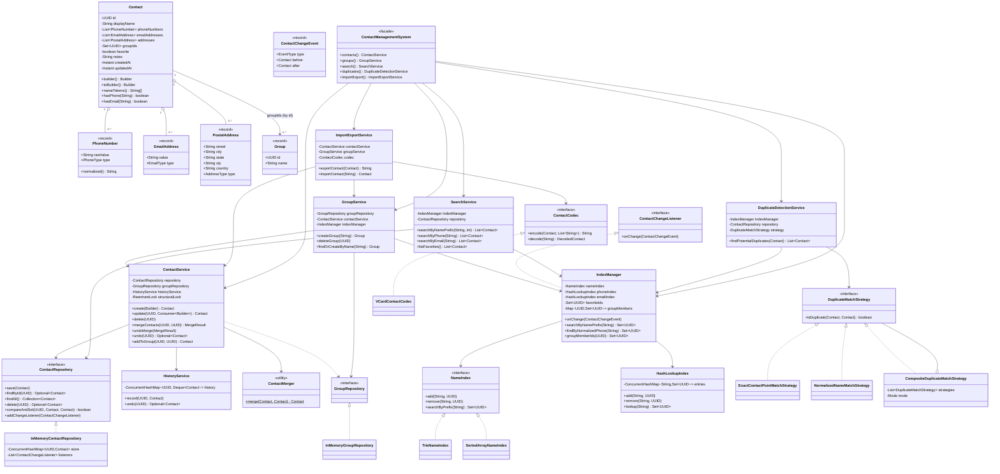

# Class Diagram

```mermaid
classDiagram
    class Contact {
        -UUID id
        -String displayName
        -List~PhoneNumber~ phoneNumbers
        -List~EmailAddress~ emailAddresses
        -List~PostalAddress~ addresses
        -Set~UUID~ groupIds
        -boolean favorite
        -String notes
        -Instant createdAt
        -Instant updatedAt
        +builder() Builder
        +toBuilder() Builder
        +nameTokens() String[]
        +hasPhone(String) boolean
        +hasEmail(String) boolean
    }
    class PhoneNumber {
        <<record>>
        +String rawValue
        +PhoneType type
        +normalized() String
    }
    class EmailAddress {
        <<record>>
        +String value
        +EmailType type
    }
    class PostalAddress {
        <<record>>
        +String street
        +String city
        +String state
        +String zip
        +String country
        +AddressType type
    }
    class Group {
        <<record>>
        +UUID id
        +String name
    }
    class ContactChangeEvent {
        <<record>>
        +EventType type
        +Contact before
        +Contact after
    }

    Contact "1" o-- "0..*" PhoneNumber
    Contact "1" o-- "0..*" EmailAddress
    Contact "1" o-- "0..*" PostalAddress
    Contact "1" --> "0..*" Group : groupIds (by id)

    class ContactRepository {
        <<interface>>
        +save(Contact)
        +findById(UUID) Optional~Contact~
        +findAll() Collection~Contact~
        +delete(UUID) Optional~Contact~
        +compareAndSet(UUID, Contact, Contact) boolean
        +addChangeListener(ContactChangeListener)
    }
    class InMemoryContactRepository {
        -ConcurrentHashMap~UUID,Contact~ store
        -List~ContactChangeListener~ listeners
    }
    ContactRepository <|.. InMemoryContactRepository

    class ContactChangeListener {
        <<interface>>
        +onChange(ContactChangeEvent)
    }

    class ContactService {
        -ContactRepository repository
        -GroupRepository groupRepository
        -HistoryService historyService
        -ReentrantLock structuralLock
        +create(Builder) Contact
        +update(UUID, Consumer~Builder~) Contact
        +delete(UUID)
        +mergeContacts(UUID, UUID) MergeResult
        +undoMerge(MergeResult)
        +undo(UUID) Optional~Contact~
        +addToGroup(UUID, UUID) Contact
    }
    class HistoryService {
        -ConcurrentHashMap~UUID, Deque~Contact~~ history
        +record(UUID, Contact)
        +undo(UUID) Optional~Contact~
    }
    class ContactMerger {
        <<utility>>
        +merge(Contact, Contact) Contact$
    }
    ContactService --> ContactRepository
    ContactService --> HistoryService
    ContactService --> ContactMerger
    ContactService ..> GroupRepository

    class GroupRepository {
        <<interface>>
    }
    class InMemoryGroupRepository
    GroupRepository <|.. InMemoryGroupRepository

    class GroupService {
        -GroupRepository groupRepository
        -ContactService contactService
        -IndexManager indexManager
        +createGroup(String) Group
        +deleteGroup(UUID)
        +findOrCreateByName(String) Group
    }
    GroupService --> GroupRepository
    GroupService --> ContactService
    GroupService --> IndexManager

    class NameIndex {
        <<interface>>
        +add(String, UUID)
        +remove(String, UUID)
        +searchByPrefix(String) Set~UUID~
    }
    class TrieNameIndex
    class SortedArrayNameIndex
    NameIndex <|.. TrieNameIndex
    NameIndex <|.. SortedArrayNameIndex

    class HashLookupIndex {
        -ConcurrentHashMap~String,Set~UUID~~ entries
        +add(String, UUID)
        +remove(String, UUID)
        +lookup(String) Set~UUID~
    }

    class IndexManager {
        -NameIndex nameIndex
        -HashLookupIndex phoneIndex
        -HashLookupIndex emailIndex
        -Set~UUID~ favoriteIds
        -Map~UUID,Set~UUID~~ groupMembers
        +onChange(ContactChangeEvent)
        +searchByNamePrefix(String) Set~UUID~
        +findByNormalizedPhone(String) Set~UUID~
        +groupMemberIds(UUID) Set~UUID~
    }
    ContactChangeListener <|.. IndexManager
    IndexManager --> NameIndex
    IndexManager --> HashLookupIndex

    class SearchService {
        -IndexManager indexManager
        -ContactRepository repository
        +searchByNamePrefix(String, int) List~Contact~
        +searchByPhone(String) List~Contact~
        +searchByEmail(String) List~Contact~
        +listFavorites() List~Contact~
    }
    SearchService --> IndexManager
    SearchService --> ContactRepository

    class DuplicateMatchStrategy {
        <<interface>>
        +isDuplicate(Contact, Contact) boolean
    }
    class ExactContactPointMatchStrategy
    class NormalizedNameMatchStrategy
    class CompositeDuplicateMatchStrategy {
        -List~DuplicateMatchStrategy~ strategies
        -Mode mode
    }
    DuplicateMatchStrategy <|.. ExactContactPointMatchStrategy
    DuplicateMatchStrategy <|.. NormalizedNameMatchStrategy
    DuplicateMatchStrategy <|.. CompositeDuplicateMatchStrategy
    CompositeDuplicateMatchStrategy o-- DuplicateMatchStrategy

    class DuplicateDetectionService {
        -IndexManager indexManager
        -ContactRepository repository
        -DuplicateMatchStrategy strategy
        +findPotentialDuplicates(Contact) List~Contact~
    }
    DuplicateDetectionService --> IndexManager
    DuplicateDetectionService --> DuplicateMatchStrategy

    class ContactCodec {
        <<interface>>
        +encode(Contact, List~String~) String
        +decode(String) DecodedContact
    }
    class VCardContactCodec
    ContactCodec <|.. VCardContactCodec

    class ImportExportService {
        -ContactService contactService
        -GroupService groupService
        -ContactCodec codec
        +exportContact(Contact) String
        +importContact(String) Contact
    }
    ImportExportService --> ContactCodec
    ImportExportService --> ContactService
    ImportExportService --> GroupService

    class ContactManagementSystem {
        <<facade>>
        +contacts() ContactService
        +groups() GroupService
        +search() SearchService
        +duplicates() DuplicateDetectionService
        +importExport() ImportExportService
    }
    ContactManagementSystem --> ContactService
    ContactManagementSystem --> GroupService
    ContactManagementSystem --> SearchService
    ContactManagementSystem --> DuplicateDetectionService
    ContactManagementSystem --> ImportExportService
    ContactManagementSystem --> IndexManager
```
