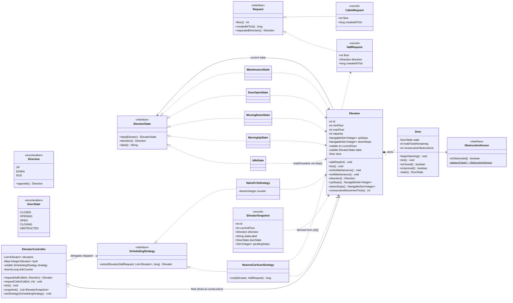

# Class Diagram

This matches the actual classes under `src/main/java/lld/elevatorsystem/`.

```mermaid
classDiagram
    direction LR

    class Direction {
        <<enumeration>>
        UP
        DOWN
        IDLE
        +opposite() Direction
    }

    class DoorState {
        <<enumeration>>
        CLOSED
        OPENING
        OPEN
        CLOSING
        OBSTRUCTED
    }

    class Request {
        <<interface>>
        +floor() int
        +createdAtTick() long
        +requestedDirection() Direction
    }

    class HallRequest {
        <<record>>
        +int floor
        +Direction direction
        +long createdAtTick
    }

    class CabinRequest {
        <<record>>
        +int floor
        +long createdAtTick
    }

    Request <|.. HallRequest
    Request <|.. CabinRequest

    class ObstructionSensor {
        <<interface>>
        +isObstructed() boolean
        +alwaysClear()$ ObstructionSensor
    }

    class Door {
        -DoorState state
        -int holdTicksRemaining
        -int consecutiveObstructions
        +beginOpening() void
        +tick() void
        +isClosed() boolean
        +isJammed() boolean
        +state() DoorState
    }
    Door --> ObstructionSensor

    class ElevatorState {
        <<interface>>
        +step(Elevator) ElevatorState
        +direction() Direction
        +label() String
    }

    class IdleState
    class MovingUpState
    class MovingDownState
    class DoorOpenState
    class MaintenanceState

    ElevatorState <|.. IdleState
    ElevatorState <|.. MovingUpState
    ElevatorState <|.. MovingDownState
    ElevatorState <|.. DoorOpenState
    ElevatorState <|.. MaintenanceState

    class Elevator {
        -int id
        -int minFloor
        -int maxFloor
        -int capacity
        -NavigableSet~Integer~ upStops
        -NavigableSet~Integer~ downStops
        -volatile int currentFloor
        -volatile ElevatorState state
        -Door door
        +addStop(int) void
        +tick() void
        +enterMaintenance() void
        +exitMaintenance() void
        +direction() Direction
        +upStops() NavigableSet~Integer~
        +downStops() NavigableSet~Integer~
        +consecutiveMovementTicks() int
    }
    Elevator "1" *-- "1" Door : owns
    Elevator --> ElevatorState : current state
    IdleState ..> Elevator : reads/mutates via step()
    MovingUpState ..> Elevator
    MovingDownState ..> Elevator
    DoorOpenState ..> Elevator
    MaintenanceState ..> Elevator

    class SchedulingStrategy {
        <<interface>>
        +selectElevator(HallRequest, List~Elevator~, long) Elevator
    }
    class NearestCarScanStrategy {
        +cost(Elevator, HallRequest) long
    }
    class NaiveFcfsStrategy {
        -AtomicInteger counter
    }
    SchedulingStrategy <|.. NearestCarScanStrategy
    SchedulingStrategy <|.. NaiveFcfsStrategy
    NearestCarScanStrategy ..> Elevator
    NearestCarScanStrategy ..> HallRequest
    NaiveFcfsStrategy ..> Elevator

    class ElevatorController {
        -List~Elevator~ elevators
        -Map~Integer,Elevator~ byId
        -volatile SchedulingStrategy strategy
        -AtomicLong tickCounter
        +requestHallCall(int, Direction) Elevator
        +requestCabinCall(int, int) void
        +tick() void
        +snapshot() List~ElevatorSnapshot~
        +setStrategy(SchedulingStrategy) void
    }
    ElevatorController "1" o-- "many" Elevator : fleet (fixed at construction)
    ElevatorController --> SchedulingStrategy : delegates dispatch

    class ElevatorSnapshot {
        <<record>>
        +int id
        +int currentFloor
        +Direction direction
        +String stateLabel
        +DoorState doorState
        +Set~Integer~ pendingStops
    }
    ElevatorSnapshot ..> Elevator : derived from (of())
```
